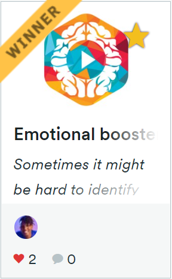
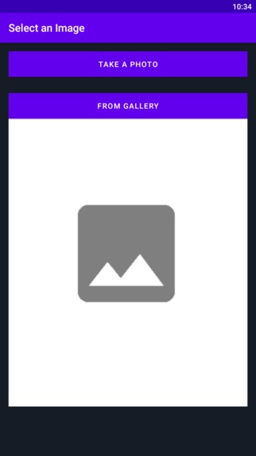

## Buy me a coffee ! 

 

    iradukundadidier2@gmail.com
    
    
## Awarded

    Azure AI Hackathon

## Intro

Sometimes it might be hard to identify the right playlist for precisely how you’re feeling. Emotional booster player  is here to help determine your mood and provide a playlist suggestion on Spotify !
## Inspiration
these days **depression**  is one of the biggest health risks of today's society means that Depression is a common illness worldwide According to  this  World Health organization page (https://www.who.int/news-room/fact-sheets/detail/depression) 

_Apparently that Many people suffer some form of depression or anxiety ,most of them . they have  mood disorder that causes a persistent feeling of sadness and loss of interest and can interfere with your daily functioning_.

So I asked myself for long time , how can I use  musics 🎶 to reduce depression and anxiety as medicine Hhh!

the question is **How does music help with depression ?**
So according to Many therapists and doctors  shows that Listening to music also has been linked to a release of oxytocin, which is known as the love or trust neurotransmitter. Oxytocin helps us bond with others and socialize, which can be an important part of treating mood disorders like depression and also Music affects the amount of stress hormones, such as adrenaline and cortisol, that the body releases, and reducing these hormones can help relieve symptoms of anxiety.

that is the reason why I decided to take risk for realizing this app with tools given to us by Microsoft Azure, namely facial recognition and speech sentiment recognition  

## screen shots 

.jpg)
.jpg)
.jpg)
.jpg)

## What it does

Sometimes it might be hard to identify the right playlist for precisely how you’re feeling,
No matter what mood you’re in, there’s music to match. How often have you sought out sad tracks when you’re in your feelings, and up-beat ones when you’re ready to seize the day? Between those two extremes there’s a full spectrum of moods and emotions—alongside a world of music that can heighten them. 
The Emotional booster is used to fetch the image from pictures taken directly by the camera or selected from the gallery, send it to Azure Face API, and display the facial recognition response. The Azure Cognitive Services Face API is used to recognize human faces in a picture. When you send a picture from the Emotional booster  to the Azure Face API, it detects human faces in the image and tells you that, within a certain position, there is a face. It will even identify certain face-related attributes such as  emotion, and then play a Spotify playlist based on the emotion detected. It is build with the help of concepts of audio & image processing and machine learning models .we also here to help determine your mood and provide a playlist suggestion.

## How we built it

**I went through these main process **

1. Created a project in Android studio environment 
2. I logged on to my Microsoft Azure portal, and created a resource for the project
3. Getting face Api : Subscription key  and endpoint 
4. built my own image recognition system or AI using Microsoft Vision
5. initialize Spotify SDK
6. built the extension using JavaScript and learned Ajax and how to parse JSON files. We used the Microsoft Cognitive Services Text Analytics Sentiment Analysis API for the sentiment analysis and the Twilio API for the calling function
7. Built an intelligent bot to help at recommending 
8. generated the apk for it, so as to test it and make it available for use

## Challenges we ran into

1. Understanding the original sample code  of  how does cognitive services REST api work.
2. coming  up with a plan, idea and solution
3. Struggling to find out the way of how can I use  image from pictures taken directly by the camera or selected from the gallery , send it to Azure Face API in android studio 
4. finding client library of Java client wrapper for the Microsoft Emotion REST API  from build.gradle file.
5. Signing up for Azure account and getting it verified
6. create and getting  subscription_key  and endpoint of Face  Api.
7. Importing Spotify SDK
8. Developing and customizing my Android application

## Accomplishments that we're proud of

1. figuring out how to use the different APIs of Microsoft Azure AI in Android Studio
2. making new friends 
3. Learning a lot and having fun!
4. I was able to build my own image recognition system or AI using Microsoft Vision

## What we learned

- I also learned how to make API requests from Android via access tokens to Microsoft's Cognitive services
- I also learned new languages like JavaFX ,CSS 
- Being able to understand Artificial intelligence concepts

## What's next for Emotional Booster player
-  EBP It is not only  made it  for  boosting emotions through musics , I will also add another different type of content like boosting Emotions through a comedy ,movies ,...etc. 
- I will also add  playing  a Youtube videos playlist based on the emotion detected 
- I plan on making it available to baby  ,it will do the work of babysitting like making tune Playlist for baby when he/she cry ,smile , sleep and  automatic messages to her mother.
- Running over apps ,where it will have the ability to function automatically !

## License 

   Copyright 2021 Didier iradukunda

    Licensed under the Apache License, Version 2.0 (the "License");
    you may not use this file except in compliance with the License.
    You may obtain a copy of the License at

       http://www.apache.org/licenses/LICENSE-2.0

    Unless required by applicable law or agreed to in writing, software
    distributed under the License is distributed on an "AS IS" BASIS,
    WITHOUT WARRANTIES OR CONDITIONS OF ANY KIND, either express or implied.
    See the License for the specific language governing permissions and
    limitations under the License.

